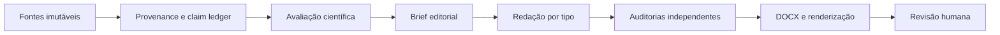

# Reviews Editorial System 0.3

O Reviews é um sistema local, Codex-native, para transformar fontes científicas em candidatas rastreáveis. A fonte científica delimita o que pode ser dito; a camada editorial decide como organizar e comunicar sem ultrapassar esses limites. Não há frontend, API, banco remoto ou publicação automática.

`reviews-writer` é a fachada compatível e roteia sete capacidades especializadas. Nenhuma delas promove uma candidata sem decisão humana explícita.
